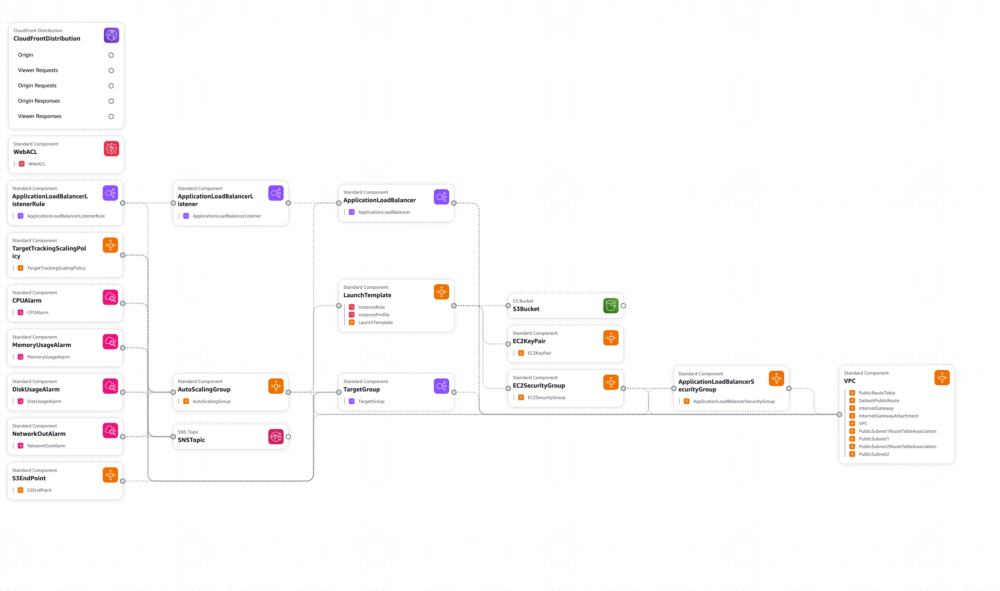

# Challenge 1: Infrastructure as Code (IaC)

## Overview

Overview of the infrastructures on Application Composer 

## Input Parameters
##### Required
- **EnvironmentName**: The name of the environment, e.g., `development`, `staging`, `production`.
- **SNSEmail**: The email address to receive the alarm notifications.
- **SSHAllowedIP**: The IP address that is allowed to SSH into the instances, e.g. `123.123.123.123/32`
##### Optional
- **InstanceType**: The EC2 instance type, default is `t2.micro`.
- **VpcCIDR**: The CIDR block for the VPC, default is `192.168.0.0/16`
- **PublicSubnet1CIDR**: The CIDR block for the public subnet 1, default is `192.168.111.0/24`
- **PublicSubnet2CIDR**: The CIDR block for the public subnet 2, default is `192.168.222.0/24`
- **CustomHeaderValue**: The custom header value that is required for the ALB to forward the request to the instances, default is `CloudFront`. You should replace this with a random value.

## Usage

1. Set up your AWS credentials and configure the AWS CLI or an AWS profile.
2. Run `aws cloudformation deploy --stack-name <replace-with-your-stack-name> --template-file=web_app.yml --capabilities CAPABILITY_IAM --parameter-overrides EnvironmentName=<replace-with-your-environment-name> SNSEmail=<replace-with-your-email> SSHAllowedIP=<replace-with-your-ip>` to deploy the stack.
3. Run `aws cloudformation delete-stack --stack-name <replace-with-your-stack-name>` to delete the stack.
4. Alternatively, you can upload the template and deploy the stack using AWS console.

After the resources are provisioned, the S3 bucket name and the CloudFront Distribution domain name will be displayed as outputs.

### Note
##### Web Application Firewall (WAF)
The Web Application Firewall for CloudFront has to be created in the  `us-east-1` region. If you wish to enable WAF, either:
- uncomment the `WebACL` section and deploy the stack in `us-east-1` 
- copy the `WebACL` template into a new file and deploy it in `us-east-1`, then manually update the `CloudFrontDistribution.WebACLId`

##### Alarm threshold
Most of the alarm and scaling policy thresholds are defined based arbitrary values which serve as a baseline for future adjust based on actual workload.

## Instance Type
- For **development**
	- `t2.micro` 
	-  `t3.small`, `t3.medium` if resource heavy
- For **production** 
	- Low traffic to moderate traffic: `t3.small`, `t3.medium`
	- High traffic: `m5.large`, `m5.xlarge`
- Any spec requirement higher than `m5.xlarge` should be considered for restructuring the architecture of the web app for horizontal scaling
- Reasons to consider `t2` over `t3`
	- `t3` is on newer generation of processor and has better network connectivity
	- they're more cost efficient compared to `t2`
	- `t3` credit utilization can be configured as `unlimited` which can sustain high CPU utilization for any period of time whenever required. In other words, the instance won't be throttled if it ran out of CPU credits
- Reasons to use `m5` in production
	- it is for consistent workload, not burstable like `t2` and `t3`
	- offers dedicated EBS bandwidth which would be suitable for storage heavy applications

## Scalability
This setup defined an Auto Scaling Group to provide the ability to scale out or scale in the  instances as required. By default, it deploys 2 instances into 2 seperate availability zones to achieve high availability.

A target tracking scaling policy has been implemented to track `ALBRequestCountPerTarget` for scale in and out according to the number of requests to the web app.

Apart from Application Load Balancer, a CloudFront Distribution is also implemented. As the web app is serving static assets (stored in S3 bucket), adding a CDN is a great option to reduce the traffics to the web app.
 
While this scaling strategy works well for a typical SPA, it doesn't not work for web app:
- that is packaged together with a database and/or in memory database(redis, memcache) into a single docker image. The database and caching components would need to extracted out first before we can scale the app horizontally.
- utilizes SQLite as the it's primary database (e.g. PocketBase). The only option we have is to scale vertically. 

## Security
#### SSH Access
In this setup, the security group for SSH (port 22) is only allowing the IP specified by the `SSHAllowedIP` parameter. The private key paired generated this script is encrypted and stored in System Manager Parameter Store. We can restrict the access to the private key and the encryption key using IAM policy.

Apart from that, there are several ways that can enchance the security for SSH access.
1. Launch the EC2 instance in private subnet and use a bastion host to access it. Configure the security group to allow SSH access from the bastion host security group only. By doing so, the EC2 instance would lose public internet access, therefore a load balancer is required for HTTP access and NAT Gateway is required for the EC2 instance to access the public internet. This setup is more complicated and requires more resources to support it.
2. Remove SSH access to the instance, instead, use System Manager Session Manager which doesn't rely on port 22. This method has some benefits to it including centralized access control via IAM policy and activities logging for audit purposes.

#### HTTP Access
This setup ensures the HTTP traffic only flowed in this direction:
> CloudFront -> Application Load Balancer -> EC2 Instances

1. The security group of the instances only allowed the HTTP traffic from ALB's security group
2. The ALB listener only forwards the HTTP traffic if the request contains a specific custom HTTP header passed from CloudFront. If the custom header is not present, the ALB will response the request with a 404 status code.
3. CloudFront can be configured with WAF that has the rules managed by AWS including `AWSManagedRulesCommonRuleSet`, `AWSManagedRulesBotControlRuleSet` and `AWSManagedRulesSQLiRuleSet` for protection against DDoS and common SQL injection. Note that WAF is not enabled by default, please refer to the usage section how to enable it. 

Such setup has several benefits:
1. ALB and EC2 is shielded from potentially unauthorized traffic.
2. Ensuring the caching optimization and payload compression is applied.
3. Ensure the traffic is encrypted with SSL.
4. Protection against common exploits through WAF.

# Challenge  2: Monitoring Integration
This setup includes CloudWatch alarms that monitor several metrics. When the alarm threshold is hit, it will trigger an alarm action to send email notification via SNS.

1. **CPU Utilization**
	- CPU utilization is an indicator on overall resource utilization. Low CPU utilization usually means the resource is over-provisioned, but it is not monitored in this setup. Instead, this setup focused on high CPU usage, which can indicate that the application is experiencing increased load or inefficient resource utilization. By setting the alarm for high CPU utilization, we can be alerted when the application is under stress so that we can take appropriate actions such as scale out the instances or optimizing the resource usage.
2. **Memory Usage**
	- Memory usage needs to be monitored at OS level. As such, CloudWatch agent is installed and configured in the instances via UserData script. This setup focused on monitoring high memory usage. High memory usage can lead to performance degradation or even application crashes. The high memory utilization can helps us identify potential memory leaks or excessive memory consumption so that we can precautive measures before the application crash by scaling up the instance or optimizing the application memory usage.
3. **Disk Usage**
	- Disk usage is same as memory usage which is required have CloudWatch agent installed in the instances. Generally, low disk utilization is not a major concern as it will not cause any performance degradation. However, it's an indicator of over-provisioning the EBS volume, which might be a concern for cost efficiency. This setup only focused on high disk utilization to help in identifying whether the application is generating excessive logs or temporary files, which might potentially lead to performance degradation. We can address this issue by increasing the disk capacity and sending the logs to CloudWatch.
4. **Network Out Traffic**
	- High network activity is an indication for excessive data transfer which can impact network performance and incur additional bandwidth costs. We can address this issue by adding CDN to cache and distribute the static contents as well as enabling HTTP compression. 

In short, monitoring these metrics can provide us with valuable insights into the overall health and performance of the application, help us to identify trends, optimize resource utilization, and make informed decisions about scaling or capacity planning.

Please note that threshold values for the alarms are arbitrary in this setup, they're meant to serve as a baseline and subject to adjustment based on actual workload.

# Challenge  3: Security Basics
In this setup, I have created an IAM role `InstanceRole` and associated it with the instances. It follows the principle of least privilege by granting only the necessary permissions required for the web application.

`InstanceRole` has two permissions:
1. `CloudWatchAgentServerPolicy` An AWS managed policy to grant permissions the instance's CloudWatch agent to send metrics to CloudWatch, which is required for Challenge 2.
2. `S3Access` which grants `s3:ListBucket` for listing the contents of the S3 bucket and `s3:GetObject` for retrieving objects. 

In additional to the `InstanceRole`, I have added an `S3Bucket` to demonstrate how the security can be further enhanced using a VPC Endpoint, `S3EndPoint` and `S3BucketPolicy` to secure the instances access towards the S3 bucket. By routing the traffic through a VPC endpoint, the data transfers between the instances and the S3 bucket traverse through public internet. This can also reduce the data transfer costs and allow the static content to be serve through the CloudFront Distribution that we have created early on. 

# Challenge 4: CI/CD Pipeline Design

Refer the documentation [CICD Pipeline.md](CICD%20Pipeline.md).